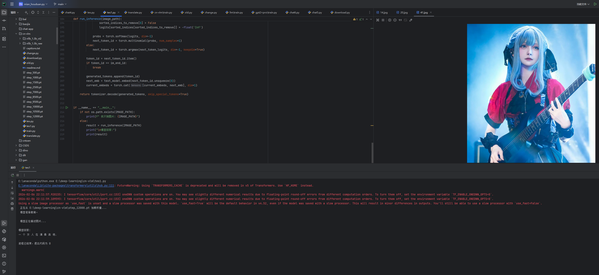
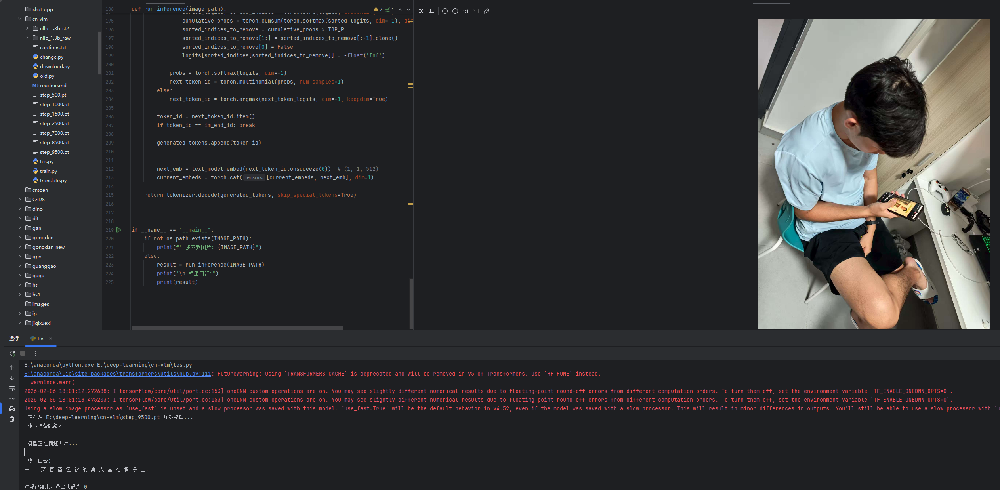
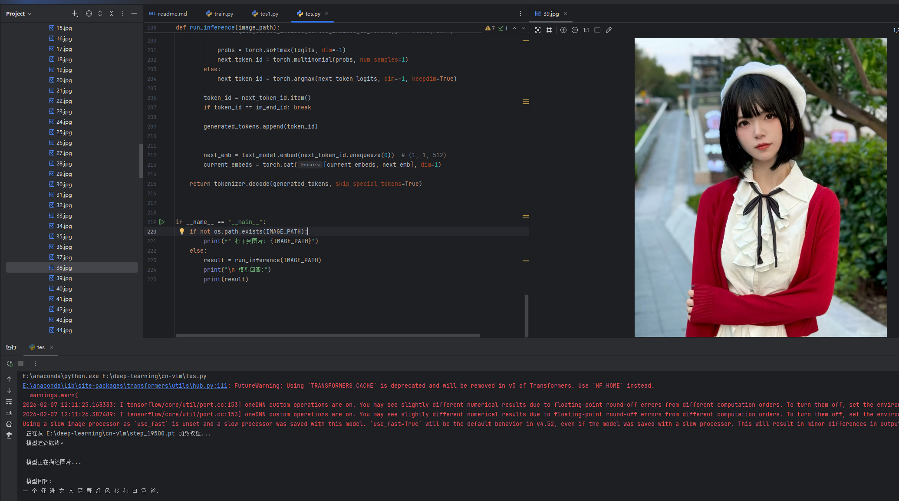
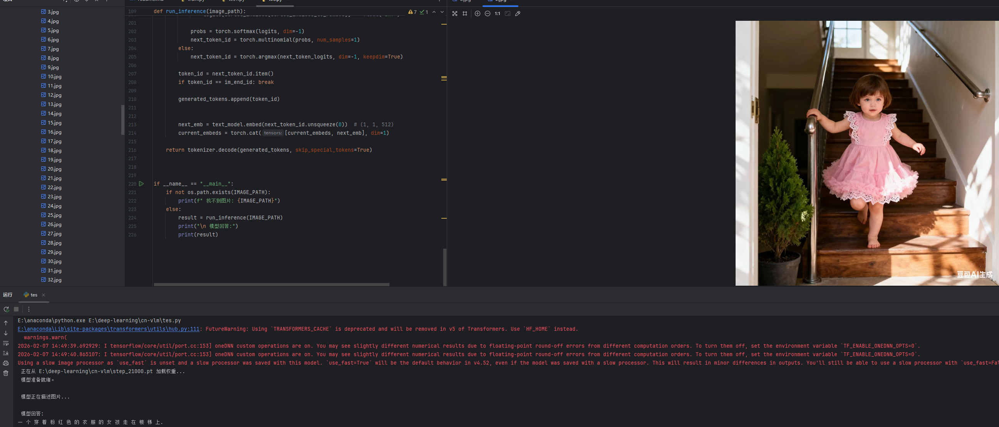

# cn-vlm

从头到尾构建一个中文 VLM

## 前置项目

- mini-llm  
- llm‘s eye  
- High-performance-batch-translator  

可以在其他仓库找到。

- mini-llm 提供中文 LLM 底模  
- llm‘s eye 提供原理以及数据集  
- High-performance-batch-translator 负责快速翻译英文数据集  

具体原理可以详见 llm‘s eye，LLM 原理详见 mini-llm。

## 效果展示

（由于是使用小模型机翻数据集，导致 VLM 描述有点机翻味）

  
  
  
  

## 如何使用

先去 llm‘s eye 下载数据集，然后根据 High-performance-batch-translator 说明进行操作翻译数据集。  
然后从 mini-llm 中获得底模。
权重下载:通过网盘分享的文件：pt.zip
链接: https://pan.baidu.com/s/1KAg3mWBtfi4XKvaorWVXrQ?pwd=prjd 提取码: prjd

```bash
python train.py
python tes.py
